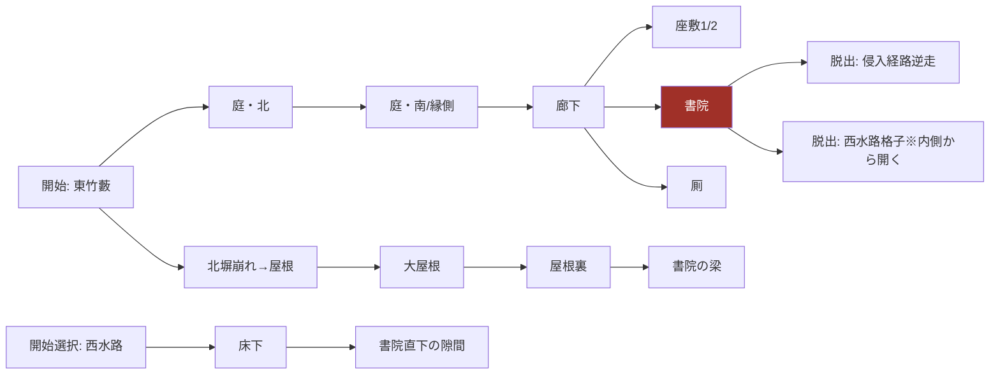

# M2 武家屋敷の粛清 — マップ図面

作成日: 2026-07-04
ステータス: Draft v1（グレーボックス制作の正本。実測チューニング後に数値を書き戻す）
前提: docs/04-level-design.md §3。**本書は図面と座標の正本**であり、04 と食い違う場合は本書を修正してから実装する。

書式規約（全ミッション共通・見本）: 平面図は 1 文字 = 2 m。座標は平面図の左上を原点 (0,0)、右方向 x+、下方向 y+（m 単位）。高さは z（地面 = 0）。

## 1. 全体平面図（地上層）1 文字 = 2 m、全域約 100 m × 64 m

```
     0         10        20        30        40        50   x(m)→ ×2
   0 ###################GG###################################
     #  竹藪(東)                 北塀                        #
     # TTTT   ,,,,,,,,,,,,,,,,,,,,,,,,,,,,,,,,,,,,,,,   TT  #
     # TTTT   , 庭(北)  o        o         o        ,   TT  #
   8 # TTTT   ,   ~~~~~~~~~                g g      ,       #
     #  W1→  ,   ~ 池 ~~~~      ┌──────────────┐   ,        #
     #       ,   ~~~~~~~        │  母屋        │   ,        #
     #       ,      ______      │ [座敷1][座敷2]│  ,         #
  16 #       ,     /縁側(南向)  │ [廊下======] │   ,        #
     #       , ggg ─────────    │ [書院*][厠 ] │   ,        #
     #       ,  o     o         └──────────────┘   ,        #
     #       ,        庭(南)  o        ggg          ,        #
  24 #       ,,,,,,,,,,,,,,,,,,,,,,,,,,,,,,,,,,,,,,,        #
     #                                                      #
     ###########==正門==################################W2###
                 (篝火BB)                            水路(西)
```

凡例: `#`=外塀(高3m・登攀不可) `T`=竹藪(SoftCover) `,`=砂利帯 `g`=茂み(HideSpot) `o`=灯篭 `B`=篝火 `~`=池/水路 `*`=標的初期位置 `W1/W2`=水路接続点 `GG`=北塀の崩れ(登攀点C1)

## 2. 区画グラフと経路 3 系統



| 経路 | 区画列 | 想定所要 | 主要リスク |
|---|---|---|---|
| A 地上 | 竹藪 → 庭北 → 縁側 → 廊下 → 書院 | 12–18 分 | 灯篭 4・提灯持ち・きしむ廊下 |
| B 頭上 | 北塀崩れ C1 → 大屋根 → 屋根裏 → 梁 | 10–15 分 | 取り付き 2 点が立哨 E1/E7 の視線内 |
| C 床下 | 西水路 W2 → 床下口 U1 → 書院直下 | 8–12 分 | 息 20 秒区間 ×2・床下のきしむ板 3 枚 |

## 3. 配置座標表

### 3.1 光源（docs/08 §10.3 LightSource）

| ID | 種別 | 座標(x,y) | ゲームプレイ半径 | 消灯可 | rain_fragile |
|---|---|---|---|---|---|
| L1–L4 | 灯篭 | (24,10) (36,20) (52,22) (70,12) | 6 m | 可（インタラクト/吹き矢） | true |
| L5, L6 | 篝火 | 正門左右 (30,52) (38,52) | 9 m | 不可 | false |
| L7 | 提灯（E5 携行） | 移動 | 6 m | E5 撃破時のみ | — |
| — | 月明かり | 全屋外 | 環境光 V 基礎値 0.25 | 不可 | — |

消灯可能比率: 屋外 4/6（月光除く）。屋内（廊下・座敷）は行灯 3 基（すべて消灯可、半径 4 m）。

### 3.2 敵配置（初期。§04 3.5 の 10 体 + 標的）

| ID | 種別 | 初期位置 | ルーチン |
|---|---|---|---|
| E1, E2 | 立哨（正門） | (32,50) (36,50) | 定点。篝火圏内から出ない |
| E3, E4 | 巡回（庭） | (20,8) 起点 / (56,22) 起点 | P1: 庭北→池畔→縁側前→庭南（周回 90 秒）/ P2: 逆回り。交差点 (40,20) 付近で 10 秒ごとにすれ違い |
| E5 | 提灯持ち | (48,16) | 庭全域を 8 の字（120 秒）。エリア警戒 1 以上で南庭往復に切替 |
| E6 | 立哨（縁側） | (34,17) | 定点。廊下側を向く。60 秒ごとに 10 秒だけ庭を向く |
| E7 | 巡回（廊下） | 廊下東端 | 廊下往復 45 秒。きしむ板 (46,17)-(50,17) 区間を必ず踏む（音の教師役） |
| E8 | 休憩（座敷1） | 座敷1 | 開始 5 分後に E7 と交代（RoutineStop の時刻タグ） |
| G1, G2 | 護衛 | 書院前廊下 | 標的ルーチンに随伴（§3.3） |
| TGT | 標的 毒山 | 書院 (58,19) | §3.3 |

### 3.3 標的ルーチン（周期 6 分・04 §3.4 の座標具体化）

| 分 | 位置 | 護衛 | 必殺機会 |
|---|---|---|---|
| 0:00–2:00 | 書院で書見 (58,19) | G1G2 廊下待機 | B: 梁直下 / C: 床の隙間 (58,20) |
| 2:00–3:00 | 廊下 → 厠 (66,19) | G1 が廊下で待つ | A: 厠は単独（背後必殺の主機会） |
| 3:00–5:00 | 座敷 2 で酒 (52,13) | G1G2 在室 | 最難（上級者の時短用） |
| 5:00–6:00 | 書院へ戻る | 随伴 | 移動中は不可寄り |

### 3.4 マーカー配置（種別と個数 — 詳細座標はシーン内が正本、個数がレビュー基準）

| マーカー | 個数 | 備考 |
|---|---|---|
| HideSpot | 茂み 5 / 戸棚 2 / 床下(死体可) 3 | 各区画に最低 1 |
| ClimbEdge | 4 | C1 北塀崩れ / 縁側→屋根 / 蔵脇 / 井戸横 |
| BeamPath | 2 | 屋根裏→書院の梁 / 座敷の梁 |
| CrawlEntrance | 3 | U1 西水路側 / 縁側下 / 厠裏 |
| SearchPoint | 12 | 区画ごと 2–3 |
| CheckpointArea | 3 | 塀内到達 / 母屋到達（縁側下）/ 暗殺成立 |
| AnomalyMarker(戸) | 4 | 縁側雨戸 2・座敷襖 2 |

## 4. きしむ板・材質マップ

- 廊下: 全面 木板。うち (46,17)-(50,17) と書院前 (56,18) は**きしむ板**（音 ×2、床下からも視認できるよう隙間あり）
- 庭: 砂利帯 `,`（×1.5）は庭の外周のみ。飛び石ルート（×1.0）が池畔に 1 本
- 床下: 土（×0.5）だが梁下 3 箇所にきしむ支え板
- 池・水路: 浅水 ×1.8 / 潜行可能域は W1–W2 と池中央

## 5. G3a 検証条件（このマップ固有）

- [ ] A/B/C 各経路の未発見クリア実測（A: 忍具 3 個以内 / B: 忍具 0 個で可能 / C: 息切れなしで可能、を各 1 回）
- [ ] 標的ルーチン 1 周期を遠見（観察ポイント: 竹藪 (6,8)・北塀上・池の対岸茂み）から全把握できる
- [ ] E3/E4 のすれ違い 10 秒窓が体感できる（デバッグオーバーレイで確認）
- [ ] 基準時間 18 分 ±30% で中級プレイが収まる
